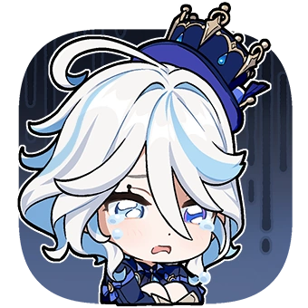

<h1>
  Hi, I'm Liuhc
  
    
  
</h1>

  I like building small projects around AI, coding, tools, and simulations.

## Interests

- machine learning
- computer vision
- competitive programming
- physics simulations
- browser tools
- game-inspired side projects

## What I'm learning

- PyTorch
- C++
- computer vision
- transformers
- building cleaner, more useful projects

## Projects

<table>
  <tr>
    <td>
      <b>ML experiments</b> 
      Small experiments with models, training loops, and computer vision.
    </td>
    <td>
      <b>Physics simulations</b> 
      Visual demos for mechanics, gravity, and motion.
    </td>
  </tr>
  <tr>
    <td>
      <b>Productivity tools</b> 
      Browser tools and focus-related projects.
    </td>
    <td>
      <b>Game-inspired projects</b> 
      Small coding side quests inspired by things I enjoy.
    </td>
  </tr>
</table>

## Fun stuff

I enjoy Genshin Impact, especially Fontaine and Furina.  
Sometimes I make game-inspired coding projects, contribution art, or small experiments.

  
furina corner

  > 不休独舞 · 芙门永存

  

    
    
    
    
    
    
  

  

    不休独舞 · 芙门永存
  

